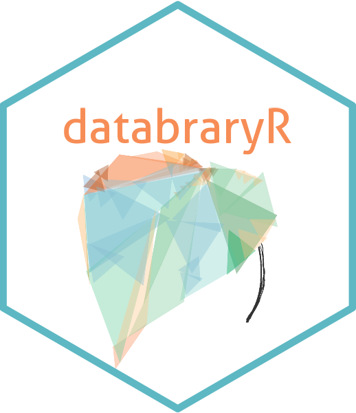

# databraryR



This repository contains code for the `databraryR` R package.

## Documentation

Full package documentation built using `pkgdown` can be found [here](https://databrary.github.io/databraryr).

## Installation

- Install the `devtools` package from CRAN: `install.packages("devtools")` if you have not already done so.
- Load `devtools` into your local environment: `library(devtools)`
- Install the `databraryr` package via `install_github("databrary/databraryr")`. Required dependencies will be installed at this time.
- The latest version is 0.3.0.

## Use

The package is under active development, as is the documentation.
Running `devtools::install_github("databrary/databraryr", force=TRUE)` regularly to get updates is strongly recommended.

### Databrary credentials

Databrary ([databrary.org](https://databrary.org)) is a data library specialized for storing and sharing video.
Access to restricted data requires [registration](https://databrary.org/register) and formal approval by an institution.
The registration process involves the creation of an (email-account-based) user account and secure password.
Once institutional authorization has been granted, a user may gain access to shared video, audio, and other data.
Many commands in the `databraryr` package return meaningful results *without* or *prior to* formal authorization.

### Configuration

Once the `databraryr` package has been installed, it may be loaded into the local environment via `library(databraryr)`.
It is advisable to configure the local environment each time the user wishes to access the system:

    login_db()  # Queries stored log on credentials or creates and stores new credentials.
  
The `login_db()` command uses the `keyring` package to create secure user name and password files using native system utilities for this purpose on Mac OS, Windows, and Linux.
This is the recommended approach.
The first time you log on to Databrary via the `databraryr` package, you will need to run `config_passd()`.
You should only need to run this once.

Once you are an authorized user on Databrary, you may also use

    login_db("myemail@myemailhost.com")
    
to log on.

Users on Mac OS and Linux systems may alternatively choose to store user account and password information in `~/api-keys/json/databrary-keys.json`.
This file has the following format:

```{json}
{
  "email":["myaccount@mymail.com"],
  "pw":["s0mEth!nGl0nGandS3CURE"]
}
```
This approach has risks as the credentials are stored as text.
Users who choose this approach should use `login_db(stored.credentials = TRUE)`.

If users choose to log in with their user names and passwords on each access -- `stored.credentials = FALSE` --- and there is no stored credentials file accessible by `keyring` -- `rstudioapi` package commands will query the user for both the user account and password.
The `rstudioapi` commands work only under [RStudio](http://www.rstudio.com).

Whatever access model is chosen, the use of a password generator/manager program (e.g., [LastPass](http://www.lastpass.com), [1Password](http://1password.com), [Dashlane](http://www.dashlane.com)) is strongly recommended.

### Command descriptions

`get_db_stats()` by default provides some data about the current number of authorized investigators, affiliates, institutions, datasets, files, and hours of stored video. Try

    get_db_stats("people")
    
to see a table of newly authorized researchers.
Or, try

    get_db_stats('datasets')
    
to see a list of the latest shared datasets.

`read_csv_data_as_df()` by default reads a publicly shared CSV data file from Databrary's volume 1 <http://databrary.org/volume/1>. Try

    with(read_csv_data_as_df(), plot(Auth_Investigators, Institutions))
  
to view a simple plot of the number of authorized investigators and institutions across time.
    
`download_video()` by default reads a short publicly shared testing video depicting a series of numbers counting up from 000. 
Unless you specify another file name, the .mp4 format movie will download to the current directory as `test.mp4`. 

`get_file_duration()` by default returns the duration (in ms) of the same publicly shared video in volume 1.

`download_datavyu()` by default downloads the Datavyu spreadsheet linked to the test video in volume 1 into a default `tmp/` directory.

`download_session_csv()` by default reads a CSV of the "sessions" spreadsheet from Databrary's volume 1 <http://databrary.org/volume/1> and returns it as a data frame.

`extract_dv()` then extracts the text files embedded in the Datavyu (.opf) file.

`dv_to_csv()` converts the extracted Datavyu file to a CSV that can be loaded as a data frame using other commands.

`list_assets_by_type()` by defaults lists the videos in Databrary volume 1 <http://databrary.org/volume/1>.

`list_assets_in_session()` by default lists *all* files in the 'Top-level Materials' folder (session/slot 9807) in volume 1 <https://nyu.databrary.org/volume/1/slot/9807/->

`list_specified_assets_in_session()` by default lists the *videos* in volume 1, session/slot 9807.

`list_people()` by default lists information about the two Databrary PIs, Karen Adolph and Rick Gilmore, and the Co-I, David Millman.

`list_volume_owners()` by default lists the volume owners for Databrary volume 1 <http://databrary.org/volume/1>.

`logout_db()` logs out of Databrary and does some simple clean up.

`get_supported_file_types()` returns a data frame with the file types Databrary currently supports.

`download_volume_zip()` downloads a zip archive of the materials in volume 31.
